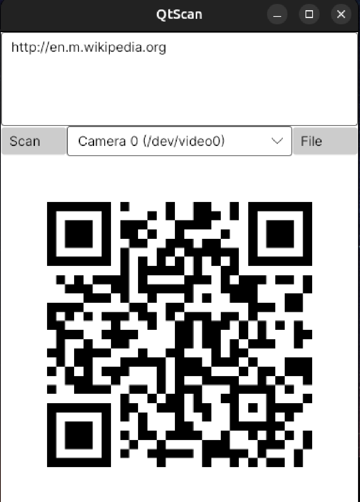

# QtScan

## Main features

- Live QR scanning from connected cameras (Windows/Linux; iOS camera support in progress)
- Decode QR codes from image files (desktop) or photo picker (iOS)
- Generate QR codes from typed text
- Real-time preview of the current scan/frame

## Screenshot



## Build

### Desktop (Windows/Linux)

```bash
# Builds the desktop target only

dotnet build QtScan/QtScan.csproj -f net9.0 -p:TargetFrameworks=net9.0
```

Or use the helper script:

```bash
./build.sh
```

### iOS

iOS builds must be run on macOS with Xcode installed. The iOS workload is not supported on Linux, so `net9.0-ios` will fail to build on Ubuntu.

```bash
# On macOS only

dotnet workload install ios
DOTNET_IOS_XCODE_VERSION=15.0 dotnet build QtScan/QtScan.csproj -f net9.0-ios -p:TargetFrameworks=net9.0-ios
```

Or use the helper scripts:

```bash
./build.sh ios
```

```powershell
.\build.ps1 -Target ios
```

## Notes

- The project is multi-targeted (`net9.0;net9.0-ios`). Use the `-p:TargetFrameworks=...` override when building a single target.

## Testing

```bash
dotnet test QtScan.Tests/QtScan.Tests.csproj
```

## Snap packaging (Ubuntu App Store)

QtScan can be published to the Ubuntu App Store (Snap Store). The Snap configuration lives at `snap/snapcraft.yaml`.

Basic workflow (run on Ubuntu):

```bash
snapcraft
snapcraft login
snapcraft register qtscan
snapcraft push --release=edge qtscan_*.snap
```


sudo SNAPCRAFT_ENABLE_EXPERIMENTAL_EXTENSIONS=1 snapcraft pack --destructive-mode
snapcraft upload qtscan_0.1.1_amd64.snap
snapcraft release qtscan [release] beta
snap run qtscan

sudo snap connect qtscan:camera

OR

Auto‑connect in the Snap Store (recommended)
Camera is a restricted interface; most snaps need store approval for auto‑connect.
If granted, users won’t have to run snap connect.
Request it in the Snapcraft Store “Permissions” page for your snap (or file a forum request).